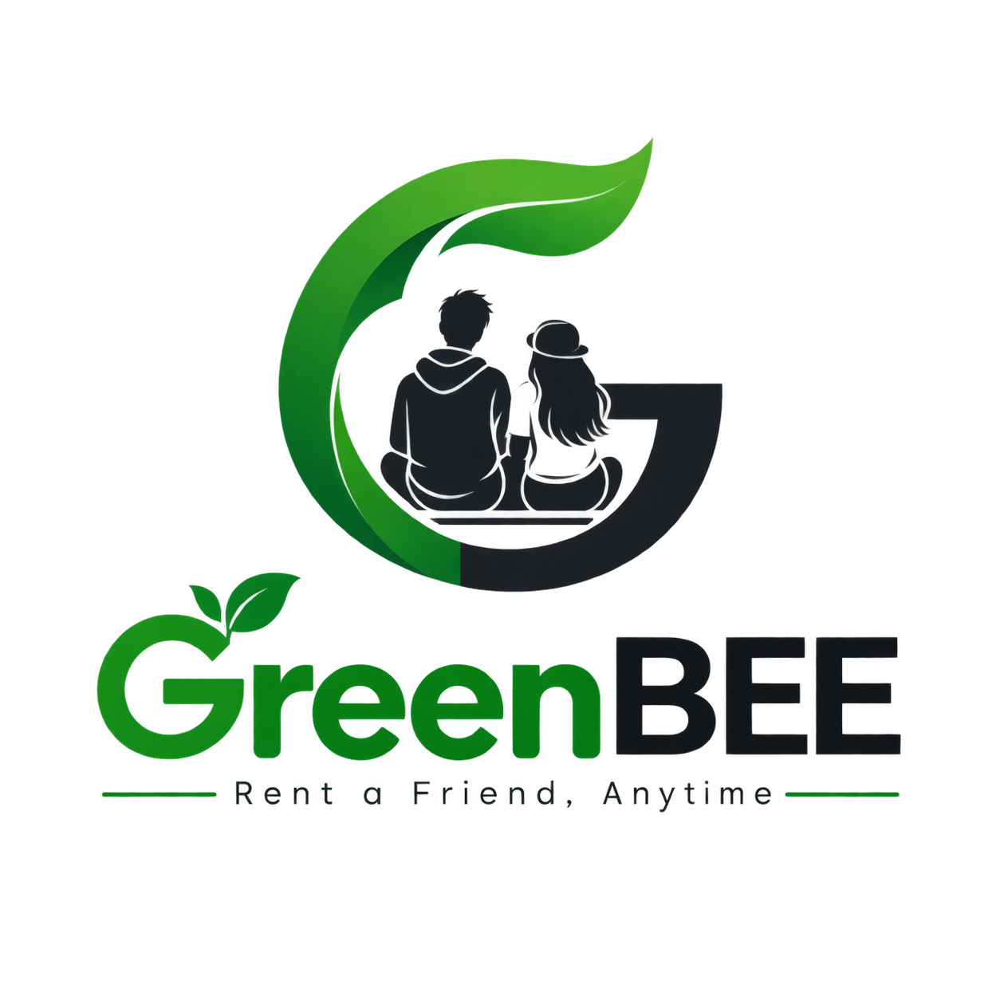

  

<h3 align="center">Rent a Friend, Anytime</h3>

<i>Because everyone deserves company when they need it most.</i>

---

## About the Project

In today's fast-paced world, people often have the time to enjoy an experience but not someone to share it with. Attending an event alone, watching a movie without company, or simply wanting someone to talk to and spend time with are common situations many people face.

GreenBEE is a platform built to solve exactly this problem. It allows users to book a companion for their outings and activities in a manner that is simple, safe, and reliable — much like booking a cab or ordering food, but for companionship.

---

## Who Is It For

- People living in a new city who are looking for company
- Individuals attending an event, party, or outing and wanting someone to accompany them
- Anyone looking to make their free time more engaging
- Users seeking respectful, professional companionship without any awkwardness

---

## Key Highlights

- **Simple Booking** — Book a companion of your choice in just a few steps
- **Nearby Search** — Find available companions around you, sorted by distance
- **Safe and Verified** — Every companion goes through a verification process to maintain trust
- **Genuine Profiles** — Real photographs are used so there is no confusion about identity
- **Availability on Demand** — No fixed schedules; book whenever the need arises
- **Clean and Straightforward Experience** — No unnecessary complications in the process

---

## The Meaning Behind the Name

"Green" represents trust, safety, and a fresh, positive experience.
"BEE" reflects the way a bee moves between flowers, connecting one to another — much like GreenBEE connects people to companionship.

The tagline, "Rent a Friend, Anytime," captures the platform's core promise: a reliable companion, available whenever needed.

---

## Future Plans

- Expanding the service to more cities
- Introducing a rating and review system for companions
- Strengthening the verification process further
- Launching a dedicated mobile application for easier access

---

<b>GreenBEE — Because everyone deserves a companion.</b>

